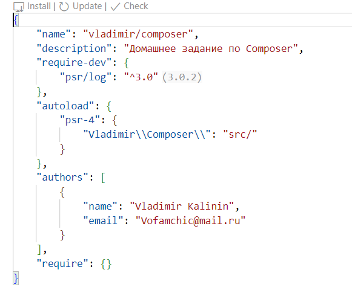

# 1 Задание

# Пакеты

* "php": "^8.2",
* "laravel/framework": "^11.9",
* "laravel/tinker": "^2.9"
* "fakerphp/faker": "^1.23",
* "laravel/pint": "^1.13",
* "laravel/sail": "^1.26",
* "mockery/mockery": "^1.6",
* "nunomaduro/collision": "^8.0",
* "phpunit/phpunit": "^11.0.1"

# config

* app.php общие переменные (имя, режим, хост)
* auth.php переменные авторизации
* cache.php переменные кэширования
* database.php переменные БД
* filesystems.php переменные файловой системы
* logging.php переменные логирования
* mail.php переменные почтовых протоколов
* queue.php переменные для заданий
* services.php переменные внешних сервисов
* session.php переменные сессии

# Директория App

Здесь хранятся основные файлы (классы) с бизнес-логикой приложения
